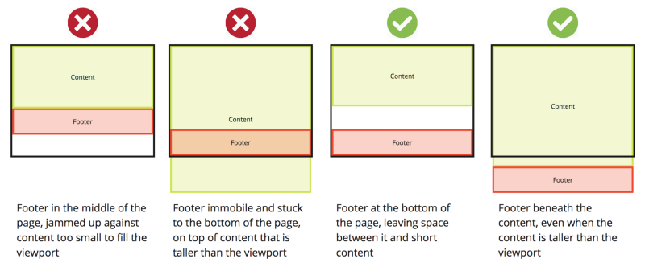

# How to keep your footer where it belongs ?
A footer is the last element on the page. At a minimum it is at the bottom of the viewport, or lower if the page content is taller than the viewport. Simple, right? ?

When working with dynamic content that includes a footer, a problem sometimes occurs where the content on a page is not enough to fill it. The footer, rather than staying at the bottom of the page where we would want it to stay, rises up and leaves a blank space beneath it.

For a quick fix, you can absolutely position the footer at the bottom of the page. But this comes with its own downside. If the content grows larger than the viewport, the footer will remain ‘stuck’ to the bottom of the viewport, whether we want it to or not.

This shows the behaviour we don’t and do want:



## **Let’s look at an approach to achieve this.**

Getting your footer under control

### *index.html:*

```html
<!DOCTYPE html>

<html>
 <head>
   <link rel="stylesheet" type="text/css" href="main.css" />
 </head>

<body>
 <div id="page-container">
   <div id="content-wrap">
     <!-- all other page content -->
   </div>
   <footer id="footer"></footer>
 </div>
</body>

</html>
```

### *main.css:*

```css
#page-container {
  position: relative;
  min-height: 100vh;
}

#content-wrap {
  padding-bottom: 2.5rem;    /* Footer height */
}

#footer {
  position: absolute;
  bottom: 0;
  width: 100%;
  height: 2.5rem;            /* Footer height */
}
```


### **So what is this doing?**


The page-container goes around everything on the page, and sets its minimum height to 100% of the viewport height (vh). As it is relative, its child elements can be set with absolute position based on it later.
The content-wrap has a bottom padding that is the height of the footer, ensuring that exactly enough space is left for the footer inside the container they are both in. A wrapping div is used here that would contain all other page content.
The footer is set to absolute, sticking to the bottom: 0 of the page-container it is within. This is important, as it is not absolute to the viewport, but will move down if the page-container is taller than the viewport. As stated, its height, arbitrarily set to 2.5rem here, is used in the content-wrap above it.
And there you have it. Your footer now stays where you would expect!


### **Final touches**


Of course, this is CSS, so it wouldn’t be complete without [some mobile-specific UX considerations](https://nicolas-hoizey.com/2015/02/viewport-height-is-taller-than-the-visible-part-of-the-document-in-some-mobile-browsers.html), and [an alternative approach](https://matthewjamestaylor.com/blog/keeping-footers-at-the-bottom-of-the-page) using `min-height: 100%` rather than `100vh`. But this has its own [drawbacks](https://stackoverflow.com/questions/6654958/make-body-have-100-of-the-browser-height/38908284#38908284).

Flexbox (with flex-grow) or Grid can also be used, and are both very powerful.

Which method you choose is entirely up to you, and the specifics of your design. Hopefully, the above example and links help you save some time in making your decision and implementing it.

Thanks for reading.